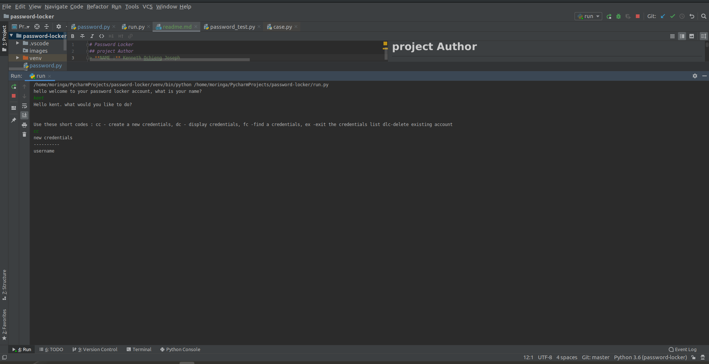
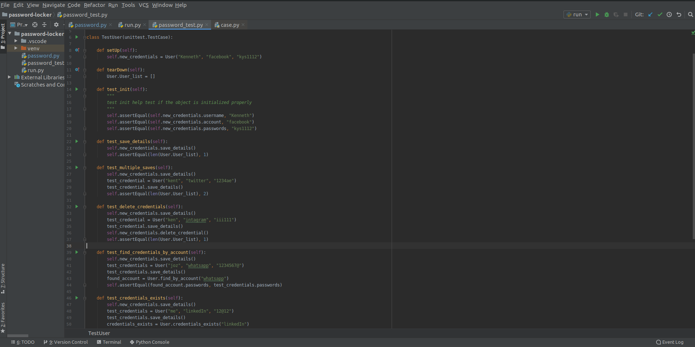

# Password Locker
## project Author
> **NAME :** Kenneth Ochieng Joseph
## Screenshots
> **Visual Presentation of My Work**
 >>##### shows the run page

 >>##### shows the test page

 >>##### shows the users and methods page

## Description
This is a platform where users have the ability of creating and saving there passwords and coping the passwords to clipboard anytime they feel like
## Who it serves
This project serves all users as long us they are literate and have accounts they would love to keep there passwords so that they can stay safe even if they forget
## Access the site
> To access the site go to the my github page and then clone the code with the name title as the readme's title

## Technologies Used
>The following are the list of technology used
 - Python

## Contact me
 > To contact me please call this number : 0708037786
 ## Note
 > The project is still under development.
 ## License
  MIT License

Copyright (c) 2019 Kenneth Ochieng Joseph

Permission is hereby granted me Kenneth Ochieng Joseph the developer of this site, free of charge, to any person obtaining a copy
of this software and associated documentation files (the "MY PORTFOLIO"), to deal
in the Software without restriction, including without limitation the rights
to use, copy, modify, merge, publish, distribute, sublicense, and/or sell
copies of the Software, and to permit persons to whom the Software is
furnished to do so, subject to the following conditions:

The above copyright notice and this permission notice shall be included in all
copies or substantial portions of the Software.

THE SOFTWARE IS PROVIDED "AS IS", WITHOUT WARRANTY OF ANY KIND, EXPRESS OR
IMPLIED, INCLUDING BUT NOT LIMITED TO THE WARRANTIES OF MERCHANTABILITY,
FITNESS FOR A PARTICULAR PURPOSE AND NONINFRINGEMENT. IN NO EVENT SHALL THE
AUTHORS OR COPYRIGHT HOLDERS BE LIABLE FOR ANY CLAIM, DAMAGES OR OTHER
LIABILITY, WHETHER IN AN ACTION OF CONTRACT, TORT OR OTHERWISE, ARISING FROM,
OUT OF OR IN CONNECTION WITH THE SOFTWARE OR THE USE OR OTHER DEALINGS IN THE
SOFTWARE. 
